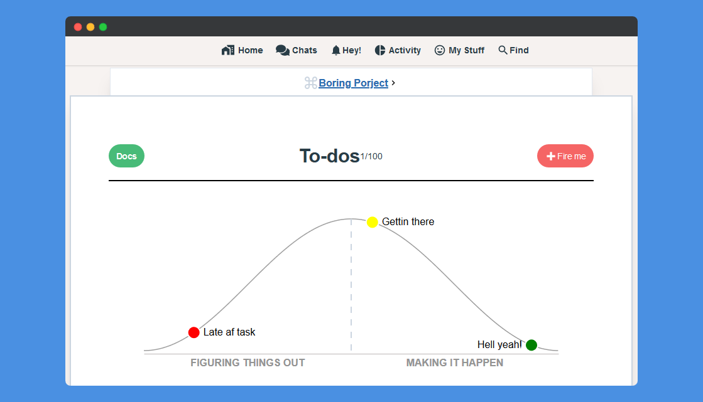

# hill-chart

[]()

[Basecamp's hill chart](https://basecamp.com/features/hill-charts) implementation using [D3.js](https://d3js.org/), **Try the [demo](https://nagi1.github.io/hill-chart/)**

<br/>

[](https://travis-ci.com/nagi1/hill-chart) [](https://scrutinizer-ci.com/g/nagi1/hill-chart/?branch=master) [](https://scrutinizer-ci.com/g/nagi1/hill-chart/?branch=master) [](https://www.codacy.com/manual/nagi1/hill-chart?utm_source=github.com&utm_medium=referral&utm_content=nagi1/hill-chart&utm_campaign=Badge_Grade) [](https://nagi1.github.io/hill-chart/) [](#contributing)
[](https://opensource.org/licenses/MIT)

<br/>

## Features

- [x] Implemented in pure ES6/JS using [D3.js](https://d3js.org)
- [x] Customizable
- [x] Tested ([kinda](#d3-testing-problems) 😅)
- [x] Easily wrapped and integrated into other UI frameworks

## Getting started

Install using yarn

```bash
yarn add hill-chart
```

using npm

```bash
npm i hill-chart
```

<br/>

Or Using CDN

Chart styles ~ 1kb

```html
<link
  rel="stylesheet"
  href="https://unpkg.com/hill-chart@latest/dist/styles.css"
/>
```

the whole bundle including d3js ~ 48kb (16kb gizp)

```html
<script src="https://unpkg.com/hill-chart@latest/dist/hill-chart.umd.js"></script>
```

---

Or if you prefer D3js and hill-chart separate bundles

Custom d3js **only** minified ~ 41kb (14 gizp)

```html
<script src="https://unpkg.com/hill-chart@latest/dist/d3.min.js"></script>
```

hill chart only minified ~8kb (2kb gzip)

```html
<script src="https://unpkg.com/hill-chart@latest/dist/hill-chart.nod3.umd.js"></script>
```

---

## Usage

1. make sure to have empty with an id or class `<svg class="hill-chart" />` on your dom

2. define some points

```js
// if dont want to use cdn
import 'hill-chart/dist/styles.css';

import HillChart from 'hill-chart';

const data = [
  {
    id: '3' // (optional)
    color: 'red',
    description: 'Late af task',
    size: 10,
    x: 12.069770990416055,
    y: 12.069770990416057,
    link: '/fired.html',
  },

  {
    id: '1' // (optional)
    color: 'yellow',
    description: 'Gettin there',
    size: 10,
    x: 55.11627906976744,
    y: 44.88372093023257,
  },
  {
    id: '2' // (optional)
    color: 'green',
    description: 'Hell yeah!',
    x: 93.48837209302326,
    y: 6.511627906976724,
    size: 10,
  },
];
```

3. (optional) define options

```js
const config = {
  target: '.hill-chart',
  width: 700,
  height: 270,
  preview: false,
};
```

```js
const hill = new HillChart(data, config);
hill.render();

hill.on('move', (x, y) => {
  console.log(`x: ${x}`);
  console.log(`y: ${y}`);
});
```

---

### Config (Object)

All default config can be override by passing `config` object to the `HillChart` instance.

```js
const config = {
  target: 'svg', // element selector it could be class, id, or svg element on page but it has to be an <svg /> element
  width: 900, // chart width
  height: 300, // chart height
  preview: false, // if true points wont be draggable
  darkMode: false, // Whether the dark color scheme is to be used
  backgroundColor: 'transparent', // Color to be used as bg, Use true for default color
  footerText: {
    // control footer text
    show: true,
    fontSize: 0.75, // in rems
  },
  margin: {
    // the margins of the inner chart from the svg frame
    top: 20,
    right: 20,
    bottom: 40,
    left: 20,
  },
};
```

---

### Data (Array)

You can define as may points as you want as long as the it have these options

```js
data: [
  {
          id: 'd4f4sd', // (optional) any unique id, if not provided it'll be auto generated for you.
          color: 'red', // color of the point it can be named color 'blue', 'red' or hex #000fff, #cccccc
          description: 'Late af task', // text next to the point, it's recommended to keep it short
          size: 10, // (optional) default size of the point
          x: 12.069770990416055, // x coordinates, (optional, defaults to 0) avoid setting it manually
          y: 12.069770990416057, // y coordinates, (optional, defaults to 0) avoid setting it manually
          link: '/fired.html', // (optional, defaults to '#') if in preview mode point became clickable
  }
],
```

---

### Events

**Name:** Move

**Trigger:** `.on('move', (x, y)=>{})`

**triggered:** while point being dragged

**payload:** the point's new coordinates

---

**_Pro tip: you may use this event to store points in the database_**

**Name:** Moved

**Trigger:** `.on('moved', (data)=>{})`

**triggered:** after point dragged

**payload:** the point's data object with new coordinates

---

**Name:** Home

**Trigger:** `.on('home', (data)=>{})`

**triggered:** if the point hit 0 on X axis

**payload:** the point's data object

---

**Name:** End

**Trigger:** `.on('en', (data)=>{})`

**triggered:** if the point hit last point on X axis

**payload:** the point's data object

---

**Name:** pointClick

**Trigger:** `.on('pointClick', (data)=>{})`

**triggered:** when clicked on the point

**payload:** the point's data object

---

## Contributing

> To get started...

- Take a quick look on [Todo List](#todo-list)
- Open issue to share and discuses new ideas or features.

### Step 2

- Fork this repo!
- Install dev dependencies
- Create new branch describes the new feature/bug.
- Do your thing :)

### Step 3

- **Be sure to include coverage tests for your awesome idea**
- Submit a new pull request

---

## Todo List

- [ ] Refactor this nasty [`drag()`](https://github.com/nagi1/hill-chart/blob/master/src/index.js#L94) event handler
- [ ] Add more test. **(depends on `drag()` refactoring)**
- [ ] Add more events, or improve the existence ones
- [ ] Add dev server/watcher
- [ ] Extract to vue components
- [ ] Feature add snow ball effect, add option to increase the point size gradually near the end.
- [ ] Improve the demo
- [ ] Add SSR demo
- [ ] Fully extract d3 modules
- [ ] Update rollup config bundles

---

### D3 testing problems

I tried my best to unit test every use case. It seems that d3js have issues regards event handling in a test environment specially with jest, add on top of this babel which has trouble importing a mutable field from d3 using the import / export syntax.

---

## Theory

If you are wondering, don't be afraid to look under the hood.

Every Step is well documented

- Start from here [src/helpers.js](https://github.com/nagi1/hill-chart/blob/master/src/helpers.js)
- then here [src/index.js](https://github.com/nagi1/hill-chart/blob/master/src/index.js)

## Inspiration (credits)

- [Basecamp](basecamp.com)
- [zemirco](https://github.com/zemirco/d3-hill-chart) (thanks for the equation)

## 🛑 Copyright notice

Hill chart is an original idea by Basecamp.
While this project aims to replicate the behavior and/or the design of the mentioned idea, it isn't by any means an attempt to reclaim the credit of the idea nor the design.
